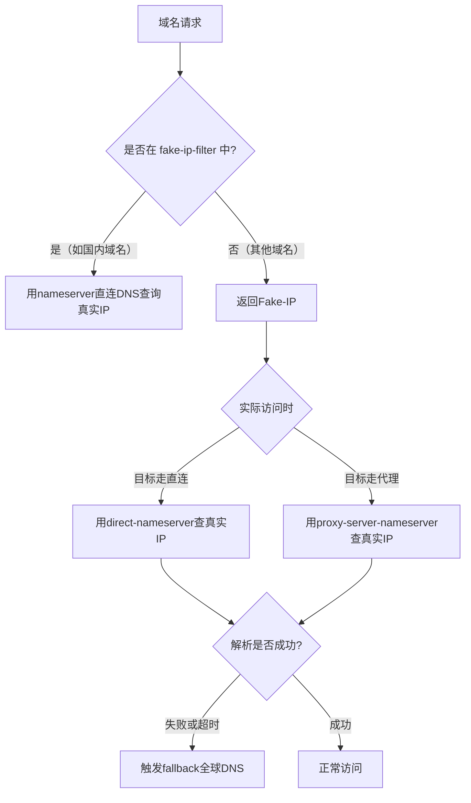

以下是为 Fake-IP 模式量身定制的 **精细化 DNS 配置方案**，已结合国内/国外 DNS 分流逻辑优化，直接复制即可使用：

---

### 最终配置文件（Fake-IP 特化版）
```yaml
dns:
  enable: true
  fake-ip-range: 198.18.0.1/16  # Fake-IP 专用网段
  fake-ip-filter:               # 跳过 Fake-IP 直接解析的域名
    - "+.lan"                   # 本地网络
    - "+.local"                 # 本地服务
    - "geosite:cn"              # 所有中国大陆域名直接解析真实IP

  # ====== 核心参数配置 ======
  default-nameserver:           # 基础解析器（必须能解析下方DoH域名）
    - 116.228.111.118           # 本地DNS（用于解析 nameserver/fallback 中的域名）
    - 180.168.255.18

  nameserver:                   # 主解析器（直连域名专用）
    - 116.228.111.118           # 本地DNS1
    - 180.168.255.18            # 本地DNS2

  fallback:                     # 备用解析器（代理/防污染专用）
    - https://dns.google/dns-query          # 谷歌DoH
    - https://dns.cloudflare.com/dns-query   # Cloudflare DoH

  proxy-server-nameserver:      # 代理流量强制使用的DNS
    - https://dns.google/dns-query           # 确保代理域名不被污染

  direct-nameserver:            # 直连流量专用DNS（与nameserver相同）
    - 116.228.111.118
    - 180.168.255.18

  direct-nameserver-follow-policy: false     # 直连不遵守策略，保持纯净

  nameserver-policy:            # 精准域名分流
    "geosite:cn":               # 国内域名强制本地DNS
      - 116.228.111.118
      - 180.168.255.18
    "geosite:geolocation-!cn":  # 非国内域名强制代理DNS
      - https://dns.google/dns-query

  fallback-filter:              # 备用触发规则（精准控制）
    geoip: true                 # 结果是中国IP则信任，不触发fallback
    geoip-code: CN              # 明确指定中国IP库
    ipcidr:                     # 过滤无效IP结果
      - 0.0.0.0/8
      - 127.0.0.0/8
    domain:                     # 仅对以下域名启用fallback
      - "geosite:geolocation-!cn"  # 非中国大陆域名
```

---

### 配置逻辑流程图


---

### 关键参数说明
1. **fake-ip-filter 优化**
   - 国内域名 (`geosite:cn`) 直接返回真实IP，避免 Fake-IP 二次解析延迟
   - 本地服务域名 (`*.lan`, `*.local`) 直接解析，兼容内网环境

2. **分流策略优先级**
   - `nameserver-policy` 规则 > `proxy-server-nameserver` > `nameserver/fallback`
   - 例如：访问 `youtube.com` 会优先匹配 `geosite:geolocation-!cn` 策略，强制使用代理DNS

3. **防污染设计**
   - 代理流量强制通过 `https://dns.google`（抗干扰强）
   - fallback 仅对境外域名启用，避免国内DNS污染

---

### 效果验证方法
1. **国内网站测试**
   ```bash
   curl -v https://www.baidu.com  # 应直连，DNS解析结果为国内IP
   ```

2. **国外网站测试**
   ```bash
   curl -v https://www.youtube.com  # 应走代理，DNS解析结果为真实IP
   ```

3. **Fake-IP 验证**
   ```bash
   nslookup non-cn-site.com       # 应返回 198.18.x.x 段IP（Fake-IP）
   ```

---

### 常见问题处理
1. **Fake-IP 导致某些应用异常**
   - 在 `fake-ip-filter` 中添加对应域名（如游戏服务器域名）

2. **fallback 触发过于频繁**
   - 调整 `fallback-filter.domain` 缩小范围
   - 或增加 `nameserver-policy` 明确指定域名

3. **DoH 连接失败**
   - 尝试改用 `tls://dns.google:853`（TLS协议）
   - 检查防火墙是否屏蔽 443/853 端口

按此配置可实现 **国内域名秒解析 + 国外域名抗污染** 的最佳平衡！
